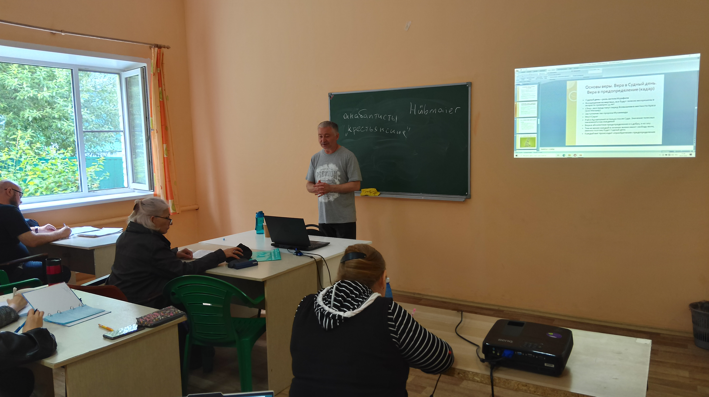
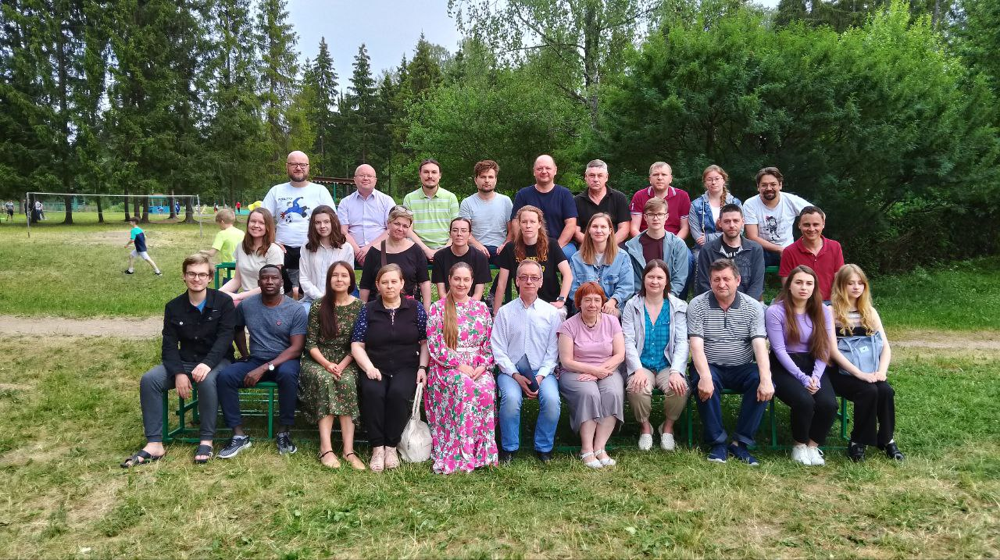
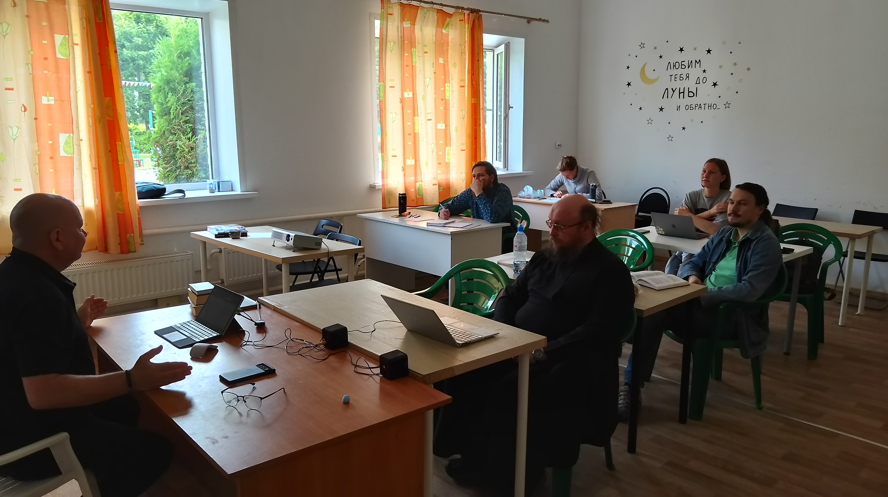
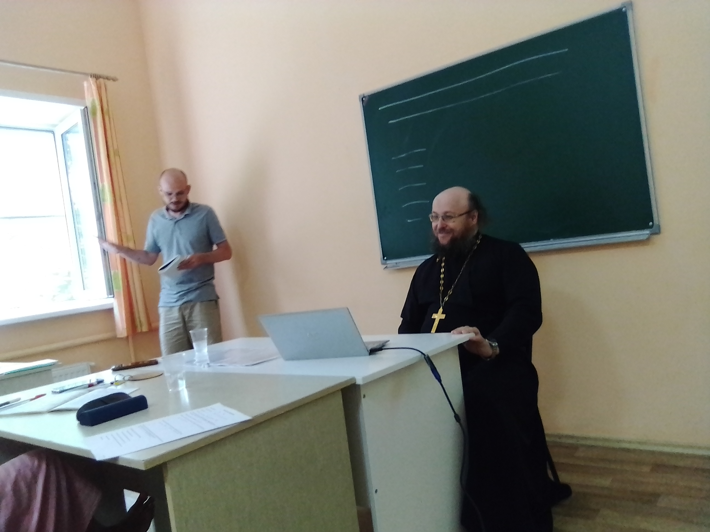
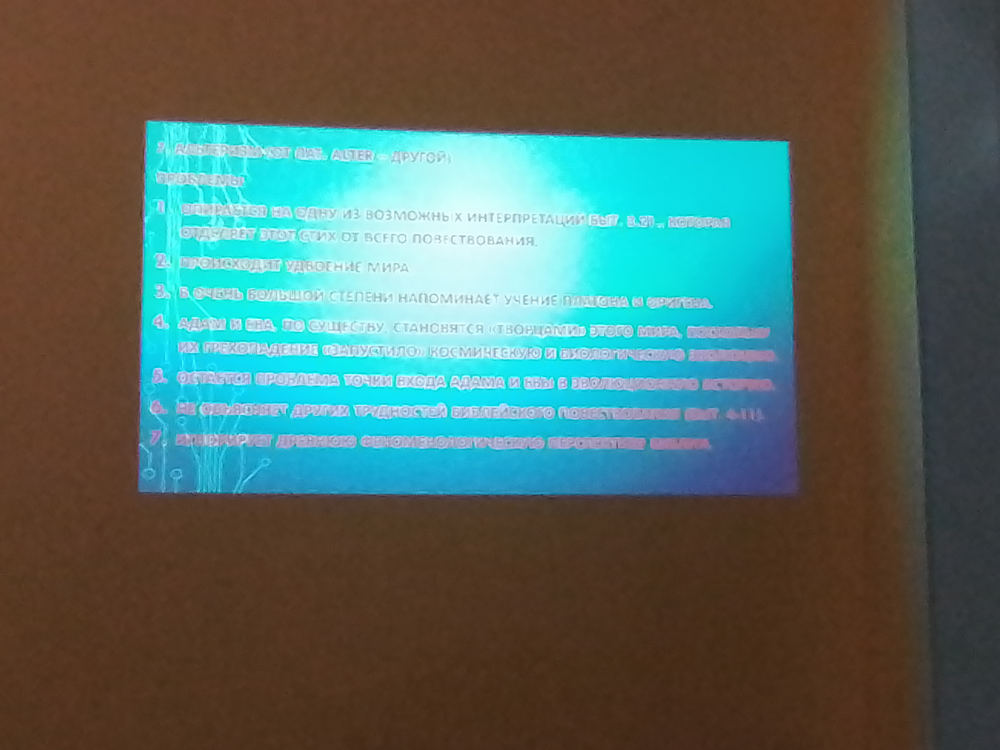
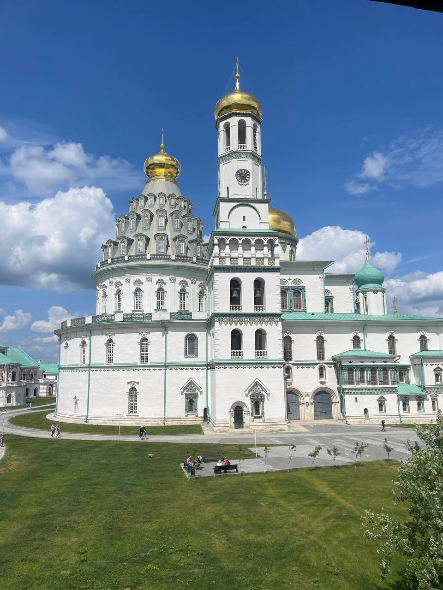
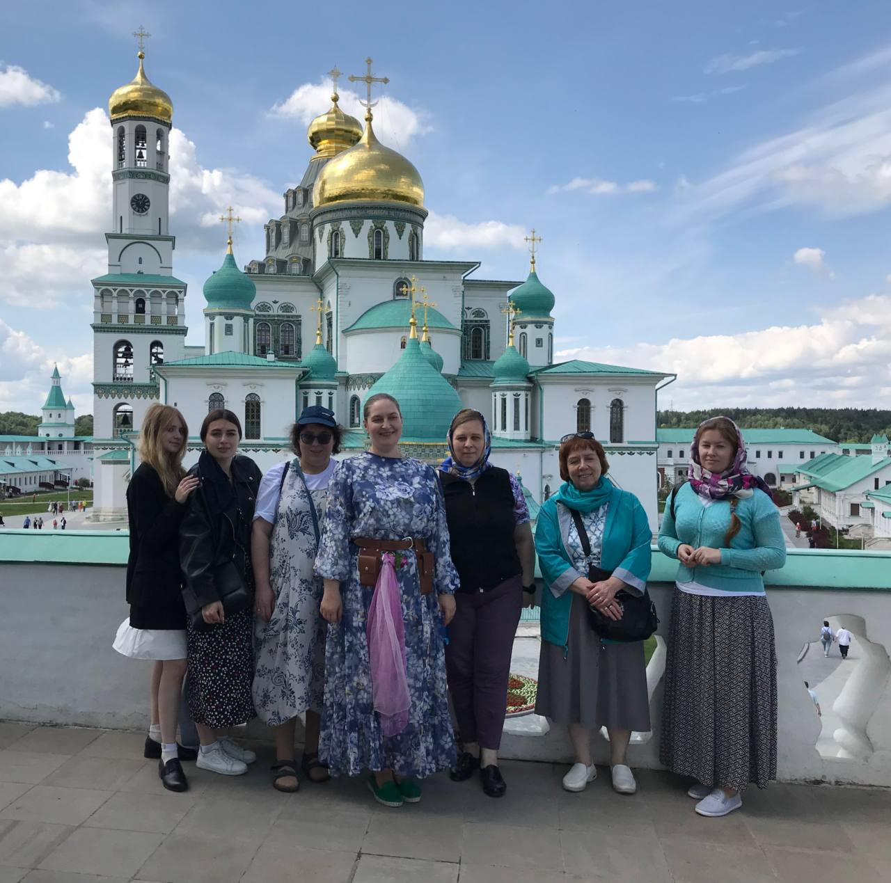

# Hello, world!

Меня зовут Ольга. Я - преподаватель педагогического университета в Москве .

В этом году мне посчастливилось побывать в Летнем богословском институте, который ежегодно проводится ББИ - Библейско-богословским институтом св. апостола Андрея (St. Andrew's Biblical Theological Institute) https://standrews.ru/

Мы очень интенсивно учились , познакомились друг с другом , с новыми преподавателями , а также с новыми дисциплинами.

Стали свидетелями дискуссии между нашим преподавателем, прот. Димитрием Кирьяновым (к.филос.н., к.богословия), и слушателем нашего потока, - сотрудником Дарвиновского музея в Москве Александром Храмовым (к.биол.н.) - о соотношении медлу эволюцией и религией! 

Пункты дискуссии: 

До настоящего момента дынные оппоненты никогда не встречались лично, поскольку дискутировали лишь в Интернете! И вот они встретились! Поскольку оба они признают эволюцию, в дискуссии победила дружба! 

Также посетили Новоиерусалимский ставропигиальный мужской монастырь, построенный по инициативе патриарха Никона, который является точной копией храма Гроба Господня в Иерусалиме . Экскурсию по нему провела директор ББИ, ученый с мировым именем, искусствовед, к.культурологии Ирина Константиновна Языкова  - специалист в области богословия иконы https://www.labirint.ru/books/358526/.

Все было очень здорово! 

Единственное, что омрачило эти дни, - это то, что на базе, где проводилось обучение, не было достаточно интернета, чтобы продолжать обучение в Нетологии. Надеюсь наверстать упущенное!